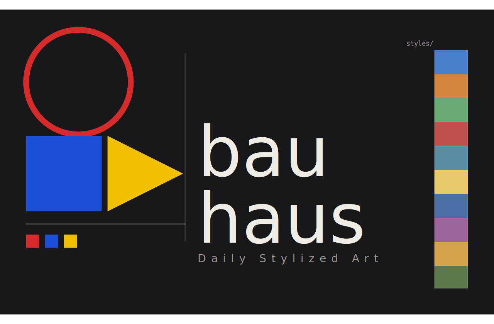

<p align="center">
  
</p>

# Bauhaus

[](https://github.com/cascadiacollections/bauhaus/actions/workflows/generate.yml)
[](LICENSE)
[](#licensing)
[](https://python.org)
[](https://github.com/astral-sh/uv)

Daily stylized art from Unsplash landscapes and public domain museum collections.

Fetches landscape photos from [Unsplash](https://unsplash.com) (default) or CC0 landscapes from the [Metropolitan Museum of Art](https://www.metmuseum.org/art/collection/search) and [Art Institute of Chicago](https://www.artic.edu/collection), applies [AdaIN](https://arxiv.org/abs/1703.06868) neural style transfer with curated style references, and serves the results via a free Cloudflare Worker API.

## Set as your wallpaper

A new landscape is generated every day overnight (4 AM UTC). Grab it and set it in one line:

**macOS**
```bash
curl -sfo /tmp/bauhaus.jpg https://bauhaus.cascadiacollections.workers.dev/api/today
osascript -e 'tell application "System Events" to tell every desktop to set picture to POSIX file "/tmp/bauhaus.jpg"'
```

**Windows** (PowerShell)
```powershell
Invoke-WebRequest https://bauhaus.cascadiacollections.workers.dev/api/today -OutFile "$env:TEMP\bauhaus.jpg"
Add-Type -TypeDefinition 'using System.Runtime.InteropServices; public class W { [DllImport("user32.dll")] public static extern int SystemParametersInfo(int a,int b,string c,int d); }'
[W]::SystemParametersInfo(0x0014,0,"$env:TEMP\bauhaus.jpg",0x01)
```

**Linux (KDE Plasma)**
```bash
curl -sfo /tmp/bauhaus.jpg https://bauhaus.cascadiacollections.workers.dev/api/today
dbus-send --session --dest=org.kde.plasmashell --type=method_call /PlasmaShell org.kde.PlasmaShell.evaluateScript "string:
var d = desktops(); for (var i = 0; i < d.length; i++) { d[i].wallpaperPlugin = 'org.kde.image';
d[i].currentConfigGroup = ['Wallpaper','org.kde.image','General']; d[i].writeConfig('Image','file:///tmp/bauhaus.jpg'); }"
```

**Linux (GNOME)**
```bash
curl -sfo /tmp/bauhaus.jpg https://bauhaus.cascadiacollections.workers.dev/api/today
gsettings set org.gnome.desktop.background picture-uri "file:///tmp/bauhaus.jpg"
gsettings set org.gnome.desktop.background picture-uri-dark "file:///tmp/bauhaus.jpg"
```

Automate it with a cron job, Task Scheduler, or systemd timer to get fresh art on your desktop every morning.

## How it works

```
GitHub Actions (daily, 4 AM UTC / 8 PM PT)
  1. Fetch landscape photo from Unsplash (or CC0 landscape from Met/AIC)
  2. Pick curated style ref (Monet, Hokusai, Cezanne, Turner, ...)
  3. AdaIN style transfer (CPU, ~5s at native resolution)
  4. Upload original + stylized + metadata to Cloudflare R2
         |
  CF Worker API <-- R2 bucket
    GET /api/today      -> stylized image
    GET /api/today.json -> metadata
    GET /api/:date      -> archive
```

Runs daily via GitHub Actions. Total cost: **$0/month**.

| Component | Monthly cost |
|-----------|-------------|
| Cloudflare R2 (10 GB free) | $0 |
| Cloudflare Workers (100k req/day free) | $0 |
| GitHub Actions (public repo) | $0 |

## API

Base URL: `https://bauhaus.cascadiacollections.workers.dev`

| Endpoint | Returns |
|----------|---------|
| `GET /api/today` | Today's stylized image |
| `GET /api/today.json` | Today's metadata (title, artist, source, license) |
| `GET /api/YYYY-MM-DD` | Stylized image for a specific date |
| `GET /api/YYYY-MM-DD/original` | Original unstylized image |
| `GET /api/YYYY-MM-DD.json` | Metadata for a specific date |

## Local development

Requires [uv](https://github.com/astral-sh/uv) and Python 3.14+.

```bash
# Install dependencies
uv sync

# Download AdaIN model weights (~94 MB)
bash models/download_models.sh

# Generate locally (no R2 upload)
uv run python src/main.py --dry-run

# Options
uv run python src/main.py --dry-run --source unsplash  # Unsplash landscape (default)
uv run python src/main.py --dry-run --source met      # Metropolitan Museum
uv run python src/main.py --dry-run --source artic    # Art Institute of Chicago
uv run python src/main.py --dry-run --alpha 0.5       # subtle style (0.0-1.0)
uv run python src/main.py --dry-run --any-subject     # disable landscape filter
```

### Docker

```bash
docker build -t bauhaus .
docker run --rm -v ./output:/app/output bauhaus --dry-run
```

### Worker

```bash
cd worker
npm ci
npx wrangler dev
```

## Configuration

| Variable | Description |
|----------|-------------|
| `R2_ENDPOINT` | Cloudflare R2 S3-compatible endpoint |
| `R2_ACCESS_KEY_ID` | R2 access key |
| `R2_SECRET_ACCESS_KEY` | R2 secret key |
| `R2_BUCKET` | Bucket name (default: `bauhaus`) |
| `STYLE_MODE` | `curated` (rotate shipped styles) or `random` (fetch second CC0 painting) |
| `UNSPLASH_ACCESS_KEY` | Unsplash API access key |
| `LANDSCAPES_ONLY` | `true` (default) bias toward landscapes/seascapes, `false` for any subject |

## Style references

10 curated CC0 paintings shipped in `styles/`, spanning Impressionism, Post-Impressionism, Japonisme, and Pointillism:

Monet, Hokusai, Cezanne, Turner, Hiroshige, Seurat, Degas, Klimt, Van Gogh, Gauguin

## Licensing

| Component | License |
|-----------|---------|
| Code | MIT |
| Input art (Unsplash) | [Unsplash License](https://unsplash.com/license) (allows derivatives and commercial use) |
| Input art (Met/AIC) | CC0 (public domain collections) |
| Style references | CC0 (same museum sources) |
| AdaIN model | MIT ([naoto0804/pytorch-AdaIN](https://github.com/naoto0804/pytorch-AdaIN)) |
| VGG-19 encoder | BSD-like (torchvision) |
| **Output images** | **Source-dependent** (CC0-1.0 for museum sources, Unsplash License for Unsplash) |
